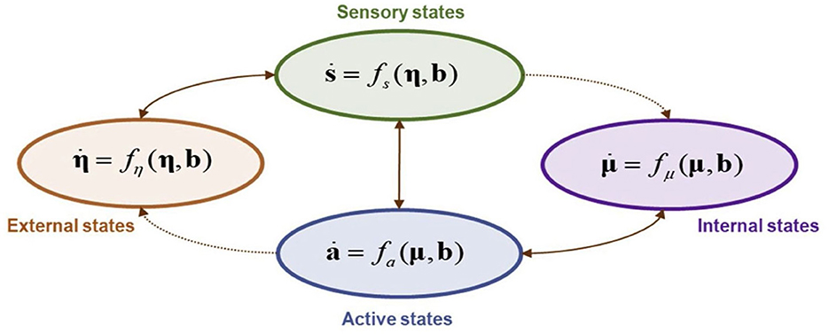

# Free Energy Principle

The Free Energy Principle (FEP) is a theoretical framework that suggests every system, be it biological or artificial, strives to minimize its surprise or prediction error. This principle has profound implications for understanding cognition, behavior, and the nature of existence itself.

## Principle
The Free Energy Principle suggests that all living organisms act to minimize a quantity called "free energy." This isn't the same as the free energy in thermodynamics but is a measure of surprise or prediction error. In simpler terms, organisms (including our brains) are constantly trying to reduce the difference between their predictions about the world and the actual sensory inputs they receive.

$$F=E[q]−H[q]$$

- $E[q]$ is the expected energy, or the average log likelihood of some data given a model.
- $H[q]$ is the entropy of the system, representing the uncertainty of the system's states.

The principle asserts that systems will change their internal states to minimize this free energy.

The Free Energy Principle offers a unified theory of brain function, suggesting that the brain is essentially a prediction machine. It constantly tries to match its predictions about the world with the actual sensory data it receives, updating its beliefs and acting in ways that reduce any discrepancies. This ongoing process of prediction, error correction, and action is how organisms maintain order and survive in a constantly changing environment.

This is a vast and deep topic, and the above is a simplified overview. For a more in-depth understanding, diving into the primary literature and research articles on the topic would be beneficial.

## Active inference
Active inference is a core concept within the Free Energy Principle framework. It describes how organisms actively engage with their environment to minimize free energy, which in turn minimizes surprise or prediction error. This process involves both perception and action.

### Perception
Our brain constantly updates its beliefs (or internal models) about the world to minimize free energy. This means we perceive the world based on our predictions and adjust these predictions when they're wrong.

### Action
Organisms act in the world to change it in a way that makes it more predictable, further reducing free energy.This is a proactive approach where actions are taken to confirm the brain's predictions about the environment. For example, if we predict that a door will open when pushed, we act by pushing it to confirm our prediction.

### Learning
Over time, the brain updates the structure of its internal models to better predict future sensory inputs. This learning process is continuous and allows the organism to adapt to changing environments. It's a dynamic interplay between the brain's predictions, the actions it takes, and the feedback it receives from those actions.

### Exploration vs. Exploitation
Active inference also involves a balance between exploration and exploitation. While it's beneficial for organisms to act in ways that confirm their predictions (exploitation), it's also crucial to explore new and unfamiliar situations to update and refine their models (exploration). This balance ensures that organisms remain adaptable and can thrive in changing environments.

### Hierarchical Models
The brain's internal models are hierarchical, with higher-level models making broad predictions and lower-level models handling finer details. Active inference operates at all levels of this hierarchy. For instance, a higher-level model might predict that it's daytime, while a lower-level model might predict the specific patterns of light and shadow in the current environment.

## Concepts

### Surprise Minimization

Systems resist disorder and aim to minimize surprise across various time scales. This is not just about predicting the immediate future but also about maintaining flexibility to adapt to unforeseen circumstances.

$$Free Energy=Energy−Entropy=Surprise+Divergence$$

### Markov Blankets

This mathematical construct defines the boundary of a system, separating internal from external states. It establishes conditional independencies and necessitates synchronization between the internal and external states. Philosophical questions arise, such as when does a part of the body (like a cut fingernail) become an external state?

### Objective Functions

In the context of FEP, objective functions should be based on beliefs about the world rather than the actual states of the world.

### Brain Specialization

While FEP provides a general framework, it's essential to consider the specialized nature of the brain. Does FEP oversimplify the intricate processes of the brain?

### System 1 and System 2

These are two distinct modes of thinking. System 1 is fast, intuitive, and automatic, while System 2 is slower, deliberate, and logical. How do these systems fit within the FEP framework? The cerebellum, for instance, is believed to play a supervisory role, monitoring the cortex and participating in supervised learning.

### Active Inference
This concept can be divided into:
- Low road: A bottom-up approach that focuses on the brain's immediate actions.
- High road: A top-down perspective emphasizing self-organization and non-equilibrium states.

## Ressources

[Vidéo interview Karl Friston](https://www.youtube.com/watch?v=KkR24ieh5Ow)

### Predictive Coding and Backpropagation

[Predictive coding approximating backprop on arbitrary graphs](https://arxiv.org/pdf/2006.04182.pdf)

A study suggests that predictive coding can approximate backpropagation on arbitrary graphs. Friston posits that any gradient can be described as a prediction error. If one believes that the universe operates based on gradient flows on some variational energy, then, by the chain rule, it implies minimizing a prediction error.

### Consciousness and FEP

[The inner screen model of consciousness: applying the free energy principle directly to the study of conscious experience](https://psyarxiv.com/6afs3)

The inner screen model of consciousness applies the FEP directly to the study of conscious experience. This model provides insights into how consciousness might emerge from the brain's attempt to minimize free energy.

### Breaking Down FEP

[Breaking Down the Free-Energy Principle](https://medium.com/neurotech-berkeley/breaking-down-the-free-energy-principle-ff7e0a61e5a3)

A comprehensive article on Neurotech Berkeley delves into the intricacies of the Free Energy Principle, making it more accessible to a broader audience.

## Flashcards
??? question "What is the Free Energy Principle (FEP)?"
    A theoretical framework suggesting every system minimizes its surprise or prediction error.
    It has implications for understanding cognition, behavior, and existence.

??? question "FEP: what is the main goal of systems?"
    To resist disorder and minimize surprise across time scales. It's about predicting the future and maintaining adaptability.

??? question "What is the formula representing the relationship between Free Energy, Energy, and Entropy?"
    Free Energy = Energy - Entropy = Surprise + Divergence

??? question "FEP: what do Markov Blankets define?"
    The boundary of a system, separating internal from external states. They establish conditional independencies and require synchronization.

??? question "In FEP, what should objective functions be based on?"
    Beliefs about the world rather than the actual states of the world.

??? question "FEP: what are System 1 and System 2?"
    - System 1 is fast, intuitive, and automatic
    - System 2 is slower, deliberate, and logical.

??? question "How does predictive coding relate to backpropagation?"
    Predictive coding can approximate backpropagation on arbitrary graphs. Any gradient can be described as a prediction error.

??? question "What does the 'inner screen model of consciousness' propose?"
    It applies the FEP directly to the study of conscious experience, suggesting consciousness emerges from the brain's attempt to minimize free energy.

??? question "FEP: what is the role of learning in the context of FEP?"
    Over time, the brain updates the structure of its internal models to better predict future sensory inputs.

??? question "FEP: what is Active Inference?"
    Active inference describes how organisms engage with their environment to minimize free energy, thus reducing surprise or prediction error. It involves both perception and action.

??? question "Active inference: how does the brain perceive the world?"
    The brain perceives the world based on its predictions and adjusts these predictions when they're wrong. It updates its beliefs or internal models to minimize free energy.

??? question "Active inference: how do organisms act in the world?"
    Organisms act proactively to confirm the brain's predictions about the environment, making the world more predictable and reducing free energy. For instance, if predicting a door will open when pushed, they push it to confirm.

??? question "Active inference: what is the significance of Exploration vs. Exploitation?"
    Active inference involves a balance between exploration (seeking new situations to refine models) and exploitation (acting in ways that confirm predictions). This ensures adaptability in changing environments.

??? question "Active inference: how are the brain's internal models structured?"
    The brain's models are hierarchical. Higher-level models make broad predictions, while lower-level models handle details. Active inference operates at all hierarchy levels, like predicting it's daytime or specific light patterns.
