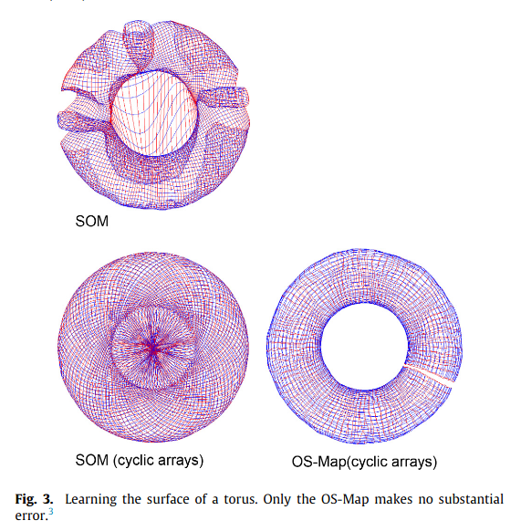

# Self-organization

## Constraints
Auto organisation emerge de contraintes:

- energetique: cout de connexion induit une plus forte connectivité avec les voisins et donc representation similaire (cf [Topographic deep artificial neural networks reproduce the hallmarks of the primate inferior temporal cortex face processing network](https://www.biorxiv.org/content/10.1101/2020.07.09.185116v1.full.pdf))
- topologique des inputs/outputs: les entrées/sorties sont déjà structurées spatialement et semantiquement, et la structure de la carte auto organisée va dans une certaine mesure refleter cette structure.
- de réduction de dimension: representer en 2D un espace à plus de 2D. (CF Petitot V1) structure de R2 x S1 qui va s'applatir et donner naissance aux pinewheels. Il doit y avoir les memes principes, plus abstraits, sur les couches plus profondes dans le processing

Il faut identifier les contraites auxquelles on est soumis et les appliquer pour voir le systeme s'auto-organiser. C'est un moyen pour atteindre une "bonne" representation mais pas un but en soi (ie si on est pas soumis a toutes ces contraintes, l'auto-organisation n'apporte peut être rien)

Interrogations sur l'intérêt des l'auto-organisation sur un substrat non adapté (bio vs hardware)

[Seven Properties of Self-Organization in the Human Brain](https://philarchive.org/archive/DRESPO-3)

1. modular connectivity
2. unsupervised learning
3. adaptive ability
4. functional resiliency
5. functional plasticity
6. from-local-to-global functional organization
7. dynamic system growth

Neurons responding to fast timescales (~1ms) vs perception taking longer (~100m)

## **SOM**

[OS-Map](https://pubmed.ncbi.nlm.nih.gov/26897100/)

Generalized SOM with orientation $\theta$ and scaling $s$, with generalized neighboors and winner selection. Original SOM become a particular case with no orientation (?) and $s=1$.

Pros of regular grid:

- indexing of nodes
- learning process
- visualization of results

Cons:

- fixed topology can be inadequate to other topologies

Scaling represents how many time a sample is presented to the map. It is a statistical representation of how many best matching nodes are in the map. It's as if the map covered the domain multiple times.

## Resources

### [Spontaneous emergence of topologically robust grid cell modules: A multiscale instability theory](https://www.biorxiv.org/content/10.1101/2021.10.28.466284v1.full.pdf)
[thread twitter](https://twitter.com/FieteGroup/status/1455269014117105664?s=20&t=uIBKxkSFMzGfl8ou7CN-8A)

Explication du phénomène émergent de création des grid cells (leurs patterns hexagonaux) grâce à la théorie de Fourier.

Excitation locale (taille fixe) + inhibition locale (taille variable) = emergence de modules discrets

En accord avec les resultats experimentaux concernant les ratios d'echelle entre les differents modules de grid cell (un des premiers modèle à le faire).

Utilisation de "Continuous Attractor Networks" pour la modélisation neuronale.

??? question "What are the main constraints from which self-organization emerges?"
    - energetic constraints (cost of connection induces stronger connectivity with neighbors)
    - topological constraints of inputs/outputs (spatially and semantically structured inputs/outputs)
    - dimension reduction constraints (representing a space with more than 2D in 2D)

??? question "List 3 properties of self-organization in the human brain"
    1. modular connectivity
    2. unsupervised learning
    3. adaptive ability
    4. functional resiliency
    5. functional plasticity
    6. from-local-to-global functional organization
    7. dynamic system growth

??? question "What phenomenon explains the emergent creation of grid cells and their hexagonal patterns?"
    The Fourier instability theory explains this phenomenon, where local excitation of fixed size combined with variable size local inhibition results in the emergence of discrete modules

??? question "What is the OS-Map, and how does it generalize the concept of Self-Organizing Maps (SOM)?"
    OS-Map is a generalized SOM with orientation and scaling, introducing generalized neighbors and winner selection. The original SOM becomes a specific case without orientation and with a scaling of 1
