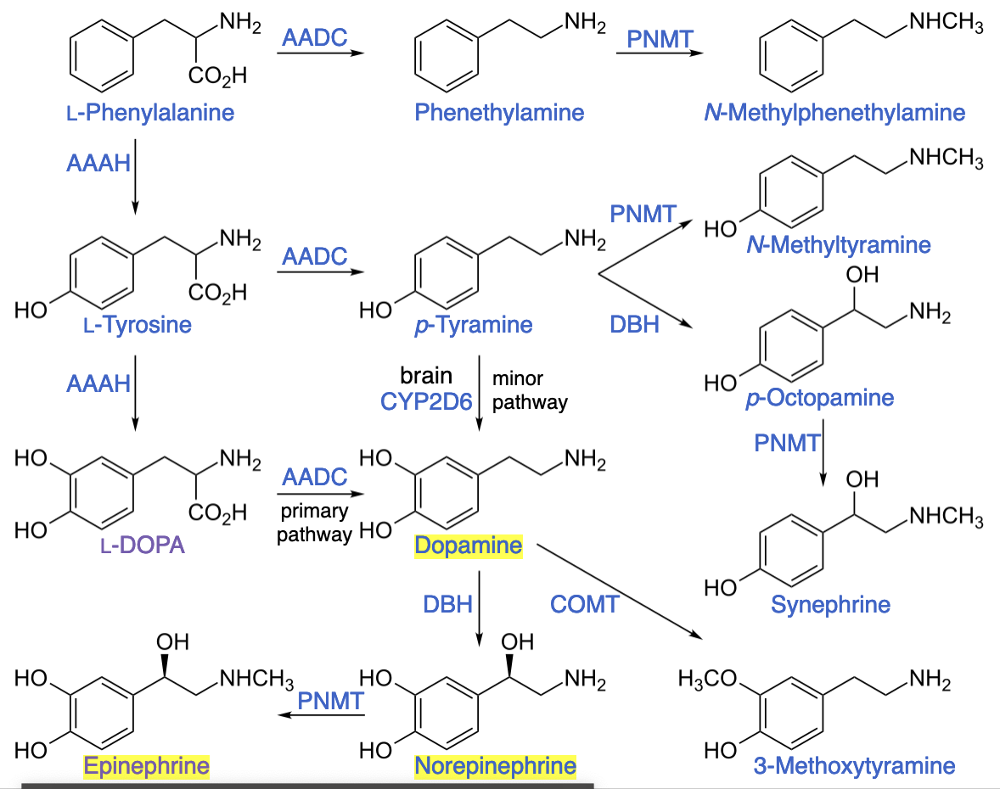

# Neurotransmitters

## Catecholamines

??? question "Biosynthesis of adrenaline"
    L-phenylalanine $\rightarrow$ L-tyrosine $\rightarrow$ L-Dopa -> Dopamine $\rightarrow$ Noradrenaline $\rightarrow$ Adrenaline

## Dopamine
[Dopamine note](../health/dopamine.md)

## Noradrenaline
Also known as **norepinephrine**

It mobilizes body for action: **fight-or-flight** reponse. It is continuously released by the body, at low levels.

In the brain:

- increases arousal and alertness
- promotes vigilance
- enhances formation and retrieval of memory
- focuses attention
- increases restlessness and anxiety

??? question "What are the effects of noradrenaline in the brain (3/5)"
     - increases arousal and alertness
     - promotes vigilance
     - enhances formation and retrieval of memory
     - focuses attention
     - increases restlessness and anxiety

In the rest of the body:

- increases heart rate and blood pressure
- triggers the release of glucose from energy stores
- increases blood flow to skeletal muscle
- reduces blood flow to the gastrointestinal system
- inhibits voiding of the bladder and gastrointestinal mobility

??? question "What are the effects of noradrenaline in the body (3/5)"
    - increases heart rate and blood pressure
    - triggers the release of glucose from energy stores
    - increases blood flow to skeletal muscle
    - reduces blood flow to the gastrointestinal system
    - inhibits voiding of the bladder and gastrointestinal mobility

## Adrenaline
Also know as **epinephrine**

Quite the same role as it's precurssor, the noradrenaline. However, it's released in large bursts in response to specific stimuli.

- fight-or-flight response
- blood sugar levels
- heart rate

Norepinephrine release is lowest during sleep, rises during wakefulness, and reaches much higher levels during situations of stress or danger, in the so-called fight-or-flight response

??? question "What is the difference between noradrenaline and adrenaline?"
    - Noradrenaline is released continuously by the nervous system at low levels
    - Adrenaline is stored in adrenal glands and released in large bursts in response to specific stimuli

## Serotonin
Serotonin is a neurostransmitter that plays an important role in mood regulation, appetite, sleep, and memory formation. It also helps regulate the body's natural defenses.

In the brain:

- regulates mood, appetite, sleep, and memory
- helps maintain social behavior
- promotes feelings of well-being and happiness
- can cause anxiety or depression when levels are too low

In the rest of the body:

- controls blood sugar levels
- regulates digestion and appetite
- helps regulate sleep
- can cause diarrhea or constipation when levels are too high

Serotonin release is highest during sleep, drops during wakefulness, and rises again during stressful situations.

More on the [Serotonine note](../health/serotonin.md)

## Acetylcholine
Acetylcholine is a neurotransmitter that plays an important role in learning, memory, attention, and motor control.

In the brain:

- facilitates learning and memory
- improves attention and concentration
- enhances sensory perception
- helps with decision making and problem solving

In the rest of the body:

- regulates muscle contraction
- stimulates digestion and appetite
- controls heart rate and blood pressure

Acetylcholine release is highest during arousal and attention, and drops during sleep.

## Glutamate
Glutamate is the most abundant neurotransmitter in the brain and plays an important role in learning, memory, and synaptic plasticity.

In the brain:

- facilitates learning and memory
- enhances synaptic plasticity
- promotes sensory perception
- helps with decision making and problem solving

In the rest of the body:

- regulates muscle contraction
- stimulates digestion and appetite
- controls heart rate and blood pressure

Glutamate release is highest during arousal and attention, and drops during sleep.

??? question "What is the main role of glutamate in the body?"
    - regulates muscle contraction
    - controls heart rate and blood pressure
    - stimulates digestion and appetite
    - facilitates learning and memory, enhances synaptic plasticity
    - promotes sensory perception
    - helps with decision making and problem solving

## GABA
GABA is a neurotransmitter that helps regulate the brain's activity by inhibiting the activity of other neurons.

In the brain:

- regulates anxiety and stress
- promotes sleep
- suppresses seizures
- enhances memory formation and retrieval

In the rest of the body:

- regulates muscle contraction
- stimulates digestion and appetite
- controls heart rate and blood pressure

GABA release is highest during relaxation and sleep, and drops during arousal and attention.

??? question "What is the main role of GABA in the body?"
    - regulates anxiety and stress
    - promotes sleep
    - suppresses seizures
    - enhances memory formation and retrieval
    - regulates muscle contraction
    - stimulates digestion and appetite
    - controls heart rate and blood pressure.
