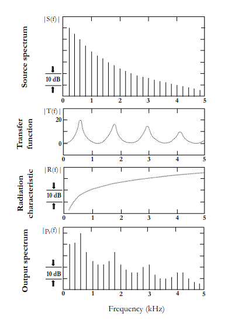

# Sound

## Neuroscience course

- IHC 95% of projection, sensory transduction
- OHC 5% of projections, signal amplification
- 3 types of neurones in the [VCN](https://en.wikipedia.org/wiki/Cochlear_nucleus) (Ventral Cochlear Nucleus):
    - Stellate: fires for sound duration $\rightarrow$ feature detection
    - Bushy: phase locked firing $\rightarrow$ localisation
    - Octopus: single spike per sound  $\rightarrow$ object binding
- A1 tuned by frequency levels and localisation
- A1 receptive fields shaped by experience (?)

## Vowel perception

[Beyond Formants: Vowel Perception at High Fundamental Frequencies](https://www.zora.uzh.ch/id/eprint/147197/8/20173177.pdf)

- **S(f)** Vocal folds
- **T(f)** Vocal tract (shape and position of larynx, tongue, ...)
- **R(f)** Mouse radiation

## Formants

**Formants**: distinctive patterns of spectral maxima.
**Formant frequency**: maxima of a formant

Distribution of first 3 formants used as cues for vowel perception
Some problems:

- F1-F2 combinations ambiguities for $\ne$ vowels across talkers
- $\ne$ vowel categories with $\sim$ formant frequencies
- Formant frequencies not flat

## Multimodality

 - Hallucinations auditives: [effet McGurk](https://fr.wikipedia.org/wiki/Effet_McGurk)
 - V1, A1, S1 anatomically interconnected

## Flashcards

??? question "What are the roles of IHC and OHC in the auditory system?"
    IHC is responsible for 95% of projection and sensory transduction, while OHC accounts for 5% of projections and provides signal amplification.

??? question "List and describe all 3 types of neurons found in the VCN"
    - Stellate (fires for sound duration - feature detection)
    - Bushy (phase-locked firing - localisation)
    - Octopus (single spike per sound - object binding)

??? question "How is A1 tuned and what affects its receptive fields?"
    A1 is tuned by frequency levels and localisation, and its receptive fields can be shaped by experience.

??? question "Identify the 3 main components involved in vowel perception and their roles"
    - S(f) - Vocal folds
    - T(f) - Vocal tract (influenced by the shape and position of the larynx, tongue, etc.)
    - R(f) - Mouth radiation

??? question "What are formants, formant frequencies? Why are they importent in vowel perception?"
    Formants are distinctive patterns of spectral maxima, with formant frequencies being the maxima of a formant.
    The distribution of the first three formants is used as cues for vowel perception

??? question "What is the McGurk effect in the context of auditory hallucinations?"
    The McGurk effect demonstrates how visual and auditory modalities can interact to produce a perceived sound different from the auditory stimulus
