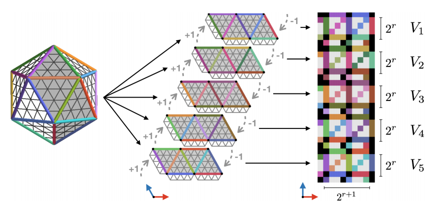

# Equivariance

## Definitions

Equivariance provides a formal notion of consistency under transformation

`Equivariance`
: A function $f : V_1 \rightarrow V_2$ is equivariant to transformations from a symmetry group $G$ if applying the symmetry to the input of $f$ is the same as applying it to the output $ \forall g \in G : f \rightarrow f(g.x) = g.f(x)$

Invariant hierarchical network $f_i \circ \rho_{i-1}(g) = \rho_{i}(g) \circ f_i$

## [Gauge Equivariant Convolutional Networks and the Icosahedral CNN](https://arxiv.org/abs/1902.04615)

- Blog post [An Easy Guide to Gauge Equivariant Convolutional Networks](https://towardsdatascience.com/an-easy-guide-to-gauge-equivariant-convolutional-networks-9366fb600b70)

- Yannic Kilcher'z video [Gauge Equivariant Convolutional Networks and the Icosahedral CNN ](https://www.youtube.com/watch?v=wZWn7Hm8osA)

> In physics, a gauge theory is a type of field theory in which the Lagrangian (and hence the dynamics of the system itself) does not change (is invariant) under local transformations according to certain smooth families of operations (Lie groups).

The gauge is defined the way we measure a vector field (e.g Celsius, Fahrenheit, Kelvin for the temperature; more complicated gauge transformation for 2D vector fields e.g rotation matrix defining the change of north/south for the wind). On a sphere, the direction/path of the kernel influences the result: parallel transport is path dependant.
Gauge equivariant means the choice of basis as no importance.

Main breakthrough: they made the new gauge equivariant convolution highly efficeint by approximating the shapes by 2D patches, to use classical technologies

Uses Icosahedron as manifolds 

The icosahedron is a regular solid with 20 faces, 30 edges, and 12 vertices  it has 60 rotational symmetries which is A5

Whereas general manifolds, and even spheres, do not admit completely regular and symmetrical pixelations, we can define an almost perfectly regular grid of pixels on the icosahedron.

## Flashcards