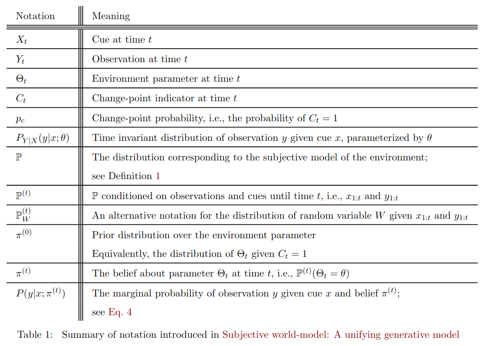
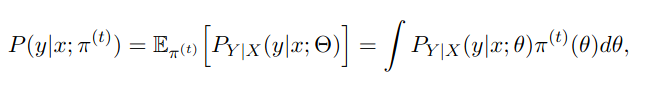
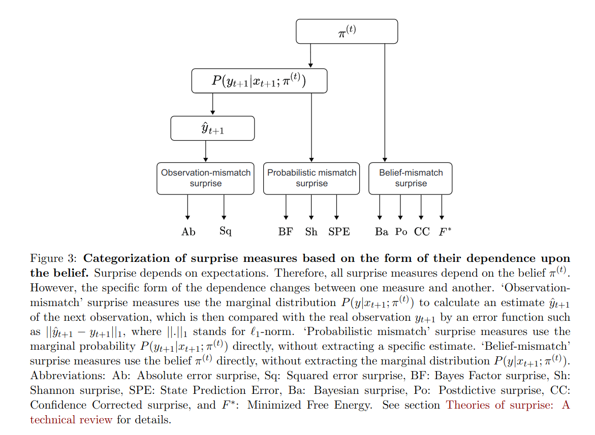

# Surprise

## [Surprise: a unified theory and experimental predictions](https://www.biorxiv.org/content/10.1101/2021.11.01.466796v1.full.pdf)

Tries to give a unifying definition of surprise. 4 main categories:

1. information gain suprise
2. prediction surprise
3. change-point detection surprise
4. confidence-correction surprise

They think that multiple neural mechanisms exist to detect and signal different aspects of surprise.

>Surprise change how we predict and perceive the future, how we remember our past.

 

Different types of surprise measure:

1. Probabilistic mismatch surprise measure (e.g shannon surprise) uses the marginal probability which depend on the belief $\pi^{(t)}$
2. Observation mismatch surprise measures (e.g prediction error $\hat{y}_{t+1}-y_{t+1}$ ) depends on the belief $\pi^{(t)}$ through some estimate of the next observation $y_{t+1}$
3. Belief-mismatch surprise measures (e.g Bayesian surprise), using the whole distribution $\pi^{(t)}$

In non volatile environments: $\Theta_i = \Theta$, pas de changement dans la parametrisation de la distribution

Signature of shannon surprise $S_{Sh1}$ found in various EEG and FMRi experiments.

## Flashcards

??? question "What are the 4 different types of surprise?"
    1. information gain suprise
    2. prediction surprise
    3. change-point detection surprise
    4. confidence-correction surprise
