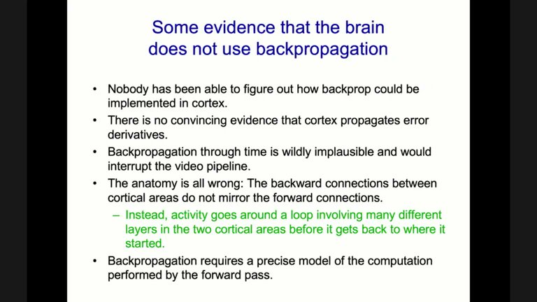
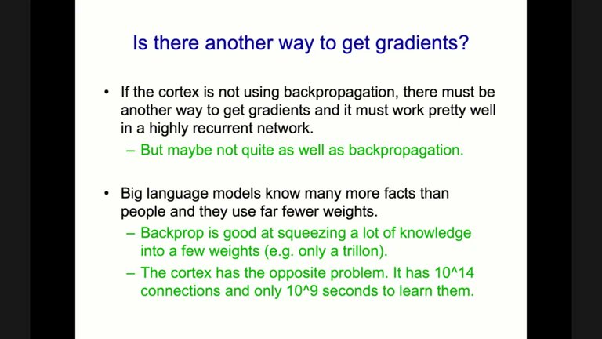
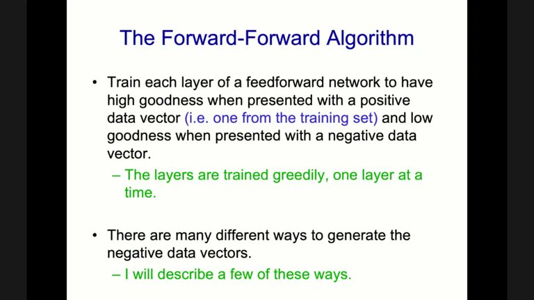

# Forward-forward
## **The Forward-Forward Algorithm: Some Preliminary Investigations**
[Hinton paper](https://www.cs.toronto.edu/~hinton/FFA13.pdf)

Related to:

- Boltzmann machines
- Contrastive learning
- Hopfield networks

Recurrent video processing

**Damping** during update rule in order to avoir biphasic oscillations

**Energy efficience :**
> An energy efficient way to multiply an activity vector by a weight matrix is to implement activities as voltages and weights as conductances. Their products, per unit time, are charges which add themselves. This seems a lot more sensible than driving transistors at high power to model the individual bits in the digital representation of a number and then performing $O(n^2)$ single bit operations to multiply two n-bit numbers together

