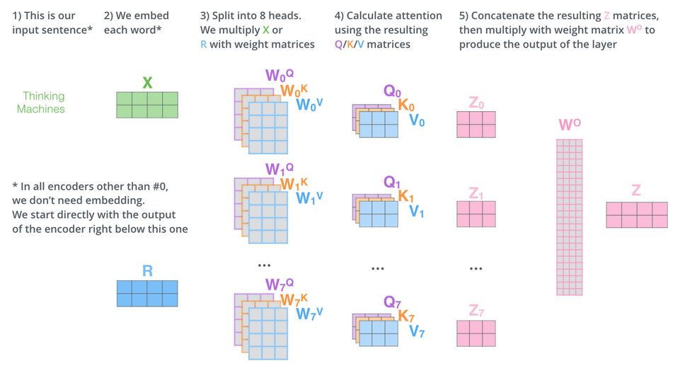
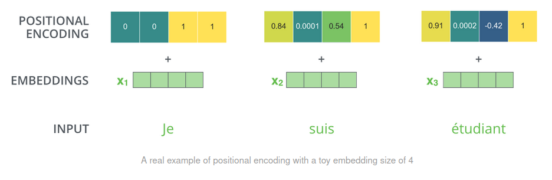
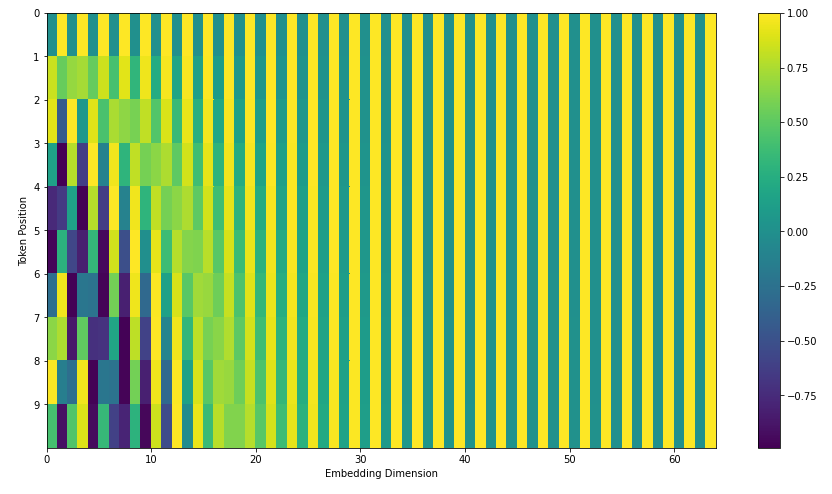

# Transformers

## Overview

Initially: architecture for a sequence transduction model without reccurence or convolution: only attention. Parallel and infinite memory

seq to seq models takes a input sequence and output a sequence of the same lenght

First: understand, compress info of the input in another rpz space

Input : "This restaurant was not too terrible"
Output: rating for this restaurant

## History

The self-attention mechanism used in Transformers can be seen as a "transformer" of the input sequence into a new representation, where each token is weighted based on its importance for generating the output sequence. The name "Transformer" reflects this idea of transforming the input sequence into a new representation using self-attention.

- 2014: first use of attention in cv. goal: understand what the network is looking at
- 2015: first use of **attention** in nlp
- 2017: first transformers for language modeling (and self-attention)

## Caracteristics
- draw connections between any part of the sequence $\Rightarrow$ no issue sith long range dependency that RNN suffers from
- more a set model than a sequential model $\Rightarrow$ positional encoding to add sequence info
- train the whole sequence $\Rightarrow$ no vanishing/exploding gradient
- treat  the sequence with no particular order
- require fewer steps to train
- has no reccurent connection $\Rightarrow$ allow parralel computation
- learn contextual relationships between words in a sentence
- add positonal encoding as position information (sequence, image)

## Architecture
### Self-attention

**Goal**: add context to word embeddings by applying some weighting or similarity from the sequence.

Basically, no weight are trained because the weighting comes from the raw word embeddings dot product. Each initial embedding $V_1$ is used three times:
- dot product between word and all other (including self) to get the weighting $W_{1j} = V_1V^j$
- dot product between weighting vector and input sequence embedding to get final embedding $Y_1=\sum_j W_{1j}V_j$

In transformers, self-attentions relies on three sets of learned embedding: query, key, values that maps original embedding into different spaces.

> The query key and value concept come from retrieval systems. For example, when you type a query to search for some video on Youtube, the search engine will map your query against a set of keys (video title, description etc.) associated with candidate videos in the database, then present you the best matched videos (values).

It is a kind of soft dictionnary

$Q$ Query: represent the word/token currently processed $Q_1=M_qV_1$

$K$ Key: represent all other words in the sequence used to compute attention weights $K_1=M_kV_1$

$V$ Value: represent the meaning of each word in the input sequence $V_1=M_vV_1$

The retrival process is similary to that of a database: $y = \sum_i similarity(q,k_i)v_i$

- measure similarity between keys and query (possibly one hot)
- weight this similary with values

Usually, for transformers we use $W_{1j} = \frac{\exp(Q_1K_j)}{\sum_{j'}\exp(Q_1K_{j'})}$

### Multi-head attention

$h$ head are trained simultaneously ( $\ne$ matrices $M_q^1$ $M_q^2$ $M_k^2$ ...) and gives differents weights

The outputs of the different heads are concatenated and projected back to the original dimensionality, which is then passed through a linear layer to produce the final output.

In multi-head attention, the query, key, and value embeddings are each projected to $h$ different subspaces using learned matrices, which allows the model to capture different types of information in parallel.

### Positonal encoding

### Decoder

Works as an autoregressive tools: for a given token, it takes all previous outputs as inputs + the ouptput of the decoder.

Output of the encoder are treated as keys and values, and the first multi-head attention output of the decoder as queries

The query is a function of the decoder's output because it depends on the curret token to be generated, so it gives this kind of context.

The attention mechanism allows the Decoder to selectively attend to the parts of the input sequence that are relevant for generating the current token in the output sequence.

If we were to treat the Encoder output as queries and the Decoder output as keys, we would essentially be asking the Decoder to provide information about the input sequence, which is not what we want. We want the Decoder to use the input sequence to generate the output sequence, not the other way around.

### Vision

Images are treated as patches, which are then embedded and treates as sequence with accoded positional encoding.

Performs well on large scale databases. But less on small datasets.

This can be explained because they have less inductive biases than CNN, so they need more data to learn some basic properites of images.

These models can also surpass CNN on high resolution  (cf paper on equivariance metric) do not struggle to model long range dependancies (all patches have a distance of one) in contrast to CNNs

## Ressources

- [Attention is all you need](https://arxiv.org/pdf/1706.03762.pdf)
- [Pytorch tutorial](https://pytorch.org/tutorials/beginner/transformer_tutorial.html)

## Flashcards
??? question "How does scaled-dot self-attention relates to a soft-dictionnary {.fbutton .ok}{.fbutton .nok}"
    $Q$ Query: represent the word/token currently processed $Q_1=M_qV_1$

    $K$ Key: represent all other words in the sequence used to compute attention weights $K_1=M_kV_1$

    $V$ Value: represent the meaning of each word in the input sequence $V_1=M_vV_1$
    ##### id: c7dfee, box: 1, score: 0/1, next: 11/10/2023, last: 11/10/2023

??? question "What is the primary mechanism behind Transformers? {.fbutton .ok}{.fbutton .nok}"
    They are an architecture for sequence transduction models using only attention mechanisms without recurrence or convolution
    ##### id: a7b8c9, box: 2, score: 1/1, next: 11/10/2023, last: 10/10/2023

??? question "How do seq-to-seq models in Transformers function? {.fbutton .ok}{.fbutton .nok}"
    They take an input sequence and output a sequence of the same length, first compressing the input information into another representation space
    ##### id: d0e1f2, box: 2, score: 1/1, next: 12/10/2023, last: 11/10/2023

??? question "How does the self-attention mechanism in Transformers use the initial embedding $V_1$? {.fbutton .ok}{.fbutton .nok}"
    - dot product between word and all other (including self) to get the weighting $W_{1j} = V_1V^j$
    - dot product between weighting vector and input sequence embedding to get final embedding $Y_1=\sum_j W_{1j}V_j$
    ##### id: 521300, box: 3, score: 2/2, next: 18/10/2023, last: 12/10/2023

??? question "What is the role of the "value" in the self-attention mechanism of Transformers? {.fbutton .ok}{.fbutton .nok}"
    The "value" represents the meaning of each word in the input sequence
    ##### id: 5213a4, box: 1, score: 0/0, next: 09/10/2023, last: 09/10/2023

??? question "How does multi-head attention in Transformers differ from regular self-attention? {.fbutton .ok}{.fbutton .nok}"
    It trains multiple heads simultaneously, capturing different types of information in parallel
    ##### id: b556e7, box: 3, score: 2/2, next: 18/10/2023, last: 12/10/2023

??? question "Why is positional encoding added in Transformers? {.fbutton .ok}{.fbutton .nok}"
    To provide sequence information since Transformers treat sequences without any particular order
    ##### id: f8f9d0, box: 3, score: 2/2, next: 19/10/2023, last: 13/10/2023

??? question "How does the decoder function in Transformers? {.fbutton .ok}{.fbutton .nok}"
    It works as an autoregressive tool, taking all previous outputs as inputs along with the encoder's output, using the attention mechanism to attend to relevant parts of the input sequence
    ##### id: a1a223, box: 1, score: 0/0, next: 09/10/2023, last: 09/10/2023

??? question "How are images processed in Transformers for vision tasks? {.fbutton .ok}{.fbutton .nok}"
    Images are treated as patches, embedded, and then handled as sequences with added positional encoding
    ##### id: b4c5d6, box: 1, score: 0/0, next: 09/10/2023, last: 09/10/2023

??? question "Name two advantages of Transformers over traditional RNNs or CNNs. {.fbutton .ok}{.fbutton .nok}"
    - can be trained in parallel
    - efficiently handle long-range dependencies
    ##### id: e7f8a9, box: 2, score: 1/1, next: 13/10/2023, last: 12/10/2023

??? question "Why might Transformers require more training data compared to CNNs? {.fbutton .ok}{.fbutton .nok}"
    They have fewer inductive biases than CNNs, so they need more data to learn some basic properties of images
    ##### id: 10a1c2, box: 3, score: 2/2, next: 18/10/2023, last: 12/10/2023

??? question "Why might Transformers perform better than CNNs on high-resolution data in terms of the equivariance metric? {.fbutton .ok}{.fbutton .nok}"
    Transformers do not struggle to model long-range dependencies as all patches have a distance of one, in contrast to CNNs
    ##### id: 4647b8, box: 1, score: 0/1, next: 12/10/2023, last: 12/10/2023

??? question "In Transformers, how is the weighting in the self-attention mechanism typically calculated? {.fbutton .ok}{.fbutton .nok}"
    $W_{1j} = \frac{\exp(Q_1K_j)}{\sum_{j'}\exp(Q_1K_{j'})}$
    ##### id: 5920c1, box: 1, score: 0/0, next: 09/10/2023, last: 09/10/2023