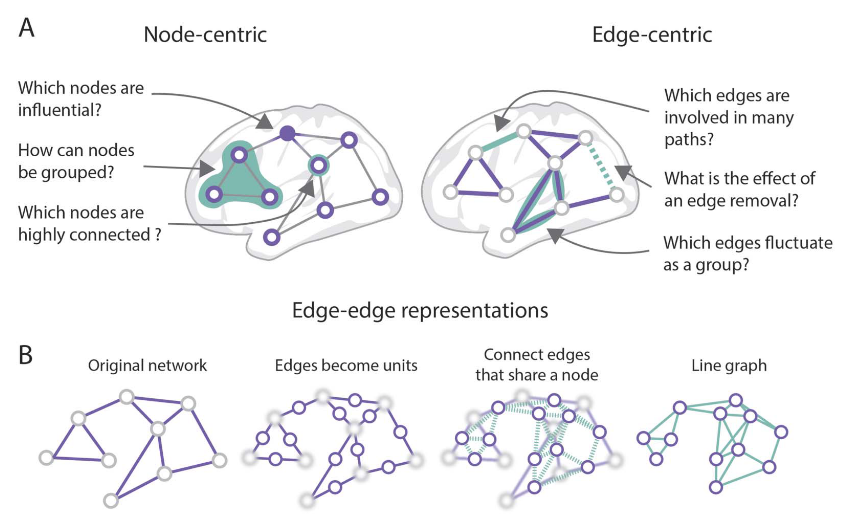

# Edge centric view of the brain network

## Ressources
### [Edges in brain networks: Contributions to models of structure and function](https://direct.mit.edu/netn/article/6/1/1/106931/Edges-in-brain-networks-Contributions-to-models-of)

> Networks are models of interrelationships between a system’s elements. In many systems, there is no inherent cost to forming a connection. The human brain, is embedded in Euclidean space where the axonal projections and white-matter tracts require material to be formed and energy to be maintained and used for signaling. For physical systems like the brain, forming and maintaining a network is costly. From a network’s perspective, these costs are felt at the level of edges, where material and metabolic costs depend on geometric characteristics of anatomical connections, for example, their length and diameter (Rivera-Alba et al.2011).

> Brain networks are organized to reduce their material and metabolic expenditures, preferring to form short-range (and therefore less costly) connections. This preference, in turn, shapes the organization of the network and induces architectural features. For instance, networks that depend strongly on spatial constraints are naturally more clustered and readily form modules, making it difficult from an algorithmic perspective to adjudicate between “true” modules and those that reflect the underlying spatial constraints.

We may have a dual view of the brain with abstractly node/edges learning

## Flashcards
??? question "How does the nature of the human brain differ from many other systems when considering the formation of connections in networks? {.fbutton .ok}{.fbutton .nok}"
    Unlike many systems where there's no inherent cost to forming a connection, the human brain, embedded in Euclidean space, requires material and energy for forming, maintaining, and signaling through axonal projections and white-matter tracts. These costs are significant at the level of edges in brain networks, where material and metabolic costs depend on geometric characteristics like the length and diameter of anatomical connections
    ##### id: 8f0ead, box: 3, score: 2/3, next: 17/10/2023, last: 11/10/2023

??? question "How does the brain's preference for reducing material and metabolic expenditures influence its network organization? {.fbutton .ok}{.fbutton .nok}"
    The brain prefers to form short-range connections which are less costly, and this preference shapes the network's organization. Networks influenced by spatial constraints tend to be more clustered and readily form modules. This makes it challenging to distinguish between "true" modules and those that merely reflect the underlying spatial constraints. The edge-centric view suggests that understanding brain networks may require considering both abstract nodes/edges and their physical attributes.
    ##### id: 5f206b, box: 1, score: 0/0, next: 09/10/2023, last: 09/10/2023