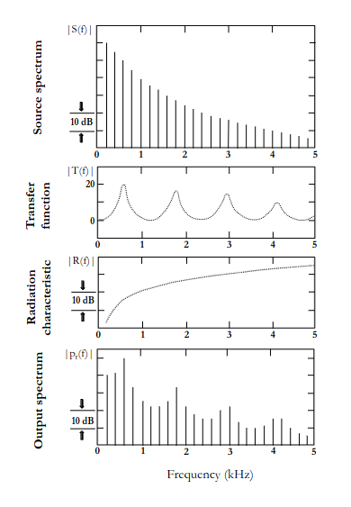

# Sound

## Neuroscience course

- IHC 95% of projection, sensory transduction
- OHC 5% of projections, signal amplification
- 3 types of neurones in the [VCN](https://en.wikipedia.org/wiki/Cochlear_nucleus) (Ventral Cochlear Nucleus):
    - Stellate: fires for sound duration $\rightarrow$ feature detection
    - Bushy: phase locked firing $\rightarrow$ localisation
    - Octopus: single spike per sound  $\rightarrow$ object binding
- A1 tuned by frequency levels and localisation
- A1 receptive fields shaped by experience (?)

## Vowel perception

[Beyond Formants: Vowel Perception at High Fundamental Frequencies](https://www.zora.uzh.ch/id/eprint/147197/8/20173177.pdf)

- **S(f)** Vocal folds
- **T(f)** Vocal tract (shape and position of larynx, tongue, ...)
- **R(f)** Mouse radiation

## Formants

**Formants**: distinctive patterns of spectral maxima.
**Formant frequency**: maxima of a formant

Distribution of first 3 formants used as cues for vowel perception
Some problems:

- F1-F2 combinations ambiguities for $\ne$ vowels across talkers
- $\ne$ vowel categories with $\sim$ formant frequencies
- Formant frequencies not flat

## Multimodality

 - Hallucinations auditives: [effet McGurk](https://fr.wikipedia.org/wiki/Effet_McGurk)
 - V1, A1, S1 anatomically interconnected

## Flashcards
??? question "What are the roles of IHC and OHC in the auditory system? {.fbutton .ok}{.fbutton .nok}"
    IHC is responsible for 95% of projection and sensory transduction, while OHC accounts for 5% of projections and provides signal amplification.
    ##### id: d758ed, box: 2, score: 1/1, next: 12/10/2023, last: 11/10/2023

??? question "List and describe all 3 types of neurons found in the VCN {.fbutton .ok}{.fbutton .nok}"
    - Stellate (fires for sound duration - feature detection)
    - Bushy (phase-locked firing - localisation)
    - Octopus (single spike per sound - object binding)
    ##### id: c825dc, box: 2, score: 1/3, next: 13/10/2023, last: 12/10/2023

??? question "How is A1 tuned and what affects its receptive fields? {.fbutton .ok}{.fbutton .nok}"
    A1 is tuned by frequency levels and localisation, and its receptive fields can be shaped by experience.
    ##### id: c7ee0e, box: 1, score: 0/1, next: 12/10/2023, last: 12/10/2023

??? question "Identify the 3 main components involved in vowel perception and their roles {.fbutton .ok}{.fbutton .nok}"
    - S(f) - Vocal folds
    - T(f) - Vocal tract (influenced by the shape and position of the larynx, tongue, etc.)
    - R(f) - Mouth radiation
    ##### id: 76f1c3, box: 2, score: 1/1, next: 13/10/2023, last: 12/10/2023

??? question "What are formants, formant frequencies? Why are they importent in vowel perception? {.fbutton .ok}{.fbutton .nok}"
    Formants are distinctive patterns of spectral maxima, with formant frequencies being the maxima of a formant.

    The distribution of the first three formants is used as cues for vowel perception
    ##### id: baa4c1, box: 2, score: 1/2, next: 12/10/2023, last: 11/10/2023

??? question "What is the McGurk effect in the context of auditory hallucinations? {.fbutton .ok}{.fbutton .nok}"
    The McGurk effect demonstrates how visual and auditory modalities can interact to produce a perceived sound different from the auditory stimulus
    ##### id: df91e6, box: 1, score: 0/0, next: 09/10/2023, last: 09/10/2023